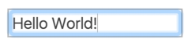
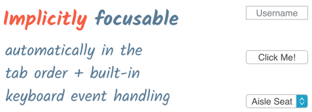
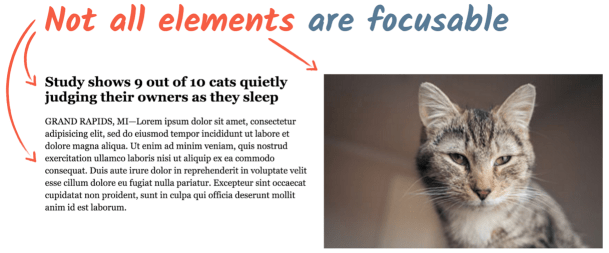
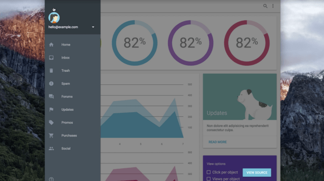
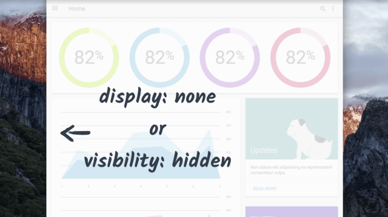
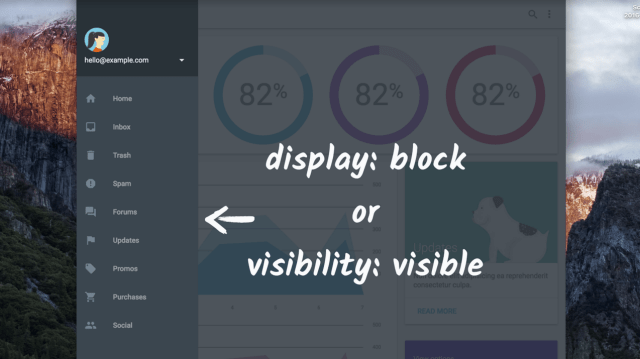

# Accessibility

* [Overview](https://developers.google.com/web/fundamentals/accessibility/)
* Focus
	* [Introduction to Focus](https://developers.google.com/web/fundamentals/accessibility/focus/)
	* [DOM Order Matters](https://developers.google.com/web/fundamentals/accessibility/focus/dom-order-matters)
	* [Using tabindex](https://developers.google.com/web/fundamentals/accessibility/focus/using-tabindex) 

## Overview

### Accessibility とは

Accessibility（ユーザー補助機能） = サイトがアクセス可能

* **誰でも** サイトのコンテンツを使用できる。
* コンテンツの機能を操作できる。

デベロッパーは、すべてのユーザーがキーボード、マウス、またはタッチ スクリーンを見ることができ、それを使用してページのコンテンツを自分と同じように操作できると考えがち。
→ 一部のユーザーには快適に動作しても、他のユーザーにとっては、不快に感じたり中断せざるをえなかったり、さまざまな問題が発生する。

Accessibility はなんらかの身体障がいや機能低下を抱えるユーザーに対して議論しがちだが、すべてのユーザーに関係がある。例えば、下記のような例も含まれる。

* スマートフォンで PC 用のサイトを思い通りに使えない
* 「このコンテンツはお住まいの地域では使用できません」というメッセージが表示される
* 使い慣れたメニューがタブレットでは見つからない

Accessibility の問題に対処することで、ほとんどの場合はすべてのユーザーのエクスペリエンスが向上する。

#### Example

改善前

* テキストのコントラストが低いため、低視力のユーザーは読みにくい可能性があります。
* 左側にラベル、右側にフィールドがあるため、多くのユーザーは関連付けがしにくく、拡大が必要なユーザーは、ほとんどページを使用できない。
* 「Remember details?」ラベルはチェックボックスに関連付けられていないため、ただラベルをクリックするのではなく、小さい正方形をタップまたはクリックする必要がある。また、スクリーンリーダーを使用するユーザーは、関連付けがわかりにくい可能性がある。

改善後

### Web Content Accessibility Guidelines

[Web Content Accessibility Guidelines (WCAG) 2.0](https://www.w3.org/TR/WCAG20/)

いくつかの国では、Accessibility の法的要件でこのガイドラインの使用を義務付けている。またWCAG は次の原則によってまとめられている。

#### POURの原則

* **知覚可能（Perceivable）**: ユーザーはコンテンツを知覚できているか。視覚など、1 つの感覚で認識できるからといって、すべてのユーザーがそれを知覚できるとは限らない。

* **操作可能（Operable）**: ユーザーは UI コンポーネントを使用したりコンテンツをナビゲートしたりできているか。例えば、カーソルを合わせる操作を必要とするものは、マウスやタッチスクリーンを使用できないユーザーは操作できない。

* **理解可能（Understandable）**: ユーザーはコンテンツを理解できているか。ユーザーが混乱することのない、分かりやすく一貫性のあるインターフェースになっているか。

* **堅牢性（Robust）**: コンテンツはさまざまなユーザーエージェント（ブラウザ）で利用できているか。支援技術で使用できているか。

[WebAIM（Web Accessibility in Mind）](https://webaim.org/)グループでは WCAG ガイドラインをわかりやすい[チェックリスト](https://webaim.org/standards/wcag/checklist)にまとめている。これは、特に Web コンテンツを対象としている。

### ユーザーの多様性について

障害には考慮すべきさまざまなカテゴリーやタイプが存在する。

* 視覚、運動、聴覚、認識の4つのカテゴリ
* 状況的、一時的、永続的の3つのタイプ

||状況的|一時的|永続的|
|---|---|---|---|
|視覚||振動|失明|
|運動|赤ん坊を抱えている|腕の骨折、RSI|RSI|
|聴覚|騒音のあるオフィス|||
|認識||振動||

RSI（反復性疲労傷害）: 手根管症候群、テニス エルボー、ばね指

## Focus

マウスの代わりにキーボードで操作できる機能を構築する方法について説明する。これは、運動障害のあるユーザーにとって重要であり、当然ながら、すべてのユーザーにとって使いやすい UI を作成することにもつながる。

* [Introduction to Focus](https://developers.google.com/web/fundamentals/accessibility/focus/)
* [DOM Order Matters](https://developers.google.com/web/fundamentals/accessibility/focus/dom-order-matters)
* [Using tabindex](https://developers.google.com/web/fundamentals/accessibility/focus/using-tabindex) 

### Introduction to Focus

#### Focus とは

フォーカスは、任意の時点におけるキーボード イベントの行き先を決定する。たとえば、テキスト入力フィールドにフォーカスを合わせて入力を開始すると、入力フィールドはキーボード イベントを受信し、入力された文字を表示する。フォーカスがある間は、クリップボードから貼り付けられた入力も受信する。

現在フォーカスされているアイテムは、多くの場合、**フォーカスリング**で示される。このスタイルは、ブラウザとページ作成者が適用したスタイル設定の両方に依存する。たとえば、Chrome では、通常、フォーカスされている要素が青色の枠でハイライト表示されるが、Firefox では破線が使用される。

WebAIM チェックリストのセクション 2.1.1 では、キーボードで処理できないもの（手書き図など）を除き、[すべてのページ機能をキーボードで使用できるようにする必要がある](https://webaim.org/standards/wcag/checklist#sc2.1.1)と明記している。

##### Tab

ユーザーは `Tab` や `Shift + Tab` ,
または矢印キーを使用して現在フォーカスされている要素を制御できる（※ブラウザによって動作は異なる）

フォーカスが `Tab` でインタラクティブな要素を前後に移動する順序は**タブオーダー**と呼ばれる。論理的なタブオーダーでページを設計することは重要なステップとなる。

#### フォーカス可能とは

暗黙的にフォーカスが可能な要素。これらの要素は自動的にタブオーダーに追加される。

* テキストフィールド
* ボタン
* 選択リスト

p、div、そのほかのさまざまなページ要素はタブで移動してもフォーカスされない設計になっている。ユーザーが操作できないものは、フォーカスする必要はない。

#### フォーカスの使用

[サンプル](http://udacity.github.io/ud891/lesson2-focus/01-basic-form/)

* キーボードのみを使用してフォームを操作できると非常に便利
* いったんマウスに切り替えてからキーボードに戻ってタスクを完了する必要がない
* フォームで使用されているすべての要素は、暗黙的なフォーカスのあるネイティブ HTML タグであるため、フォームはキーボードで適切に動作し、フォーカス動作の追加や管理のためのコードを記述する必要がない。

### DOM Order Matters

[サンプル](./dom-order-matter.html) 上で `Tab` を押すと**OK例**ではマークアップ順にボタンがフォーカスされる。

DOMでの順序を保持したまま表示順を異なるようにしてしまうと（**NG例**)、フォーカスされる順番が直感的ではなくなる。

WebAIM チェックリストのセクション 1.3.2 では、[コード順によって決定される読み取りとナビゲーションの順序は、論理的かつ直感的にする必要がある](https://webaim.org/standards/wcag/checklist#sc1.3.2)と既定されている。

**習慣的にタブオーダーがおかしなことになっていないかを確認する**

#### 画面外のコンテンツ

現在表示されていなくてもDOMには必要なコンテンツ（レスポンシブサイドナビゲーションなど）にはフォーカスがあたらないようにし、ユーザーが操作できる範囲でのみフォーカスが当たるようにする。

##### 対応

コンソールで `document.activeElement` を使用することで現在フォーカスされている要素を取得できる。

現在フォーカスが当たっている画面外の要素を特定できたら、それを `display: none` または `visibility: hidden` に設定をすることでフォーカスが当たらなくなる。  
元に戻す場合は `display: block | inline` または `visibility: visible` を設定する。

公開前にデベロッパー側でサイト上をタブで移動し、フォーカスが消えたり、論理的ではない順序で移動したりしないことを確認する。

問題がある場合は、`display: none` または `visibility: hidden` で画面外のコンテンツを適切に非表示にするか、要素の DOM での物理的な位置を変更して論理的な順序になるようにする必要がある。

## Semantics

さまざまな支援技術と連携できる堅牢な方法で、UI を作成できるようにする。

## Accessible Styles

ビジュアルデザインについて検討し、できる限り柔軟で便利な視覚要素を作成するためのテクニックを紹介。
