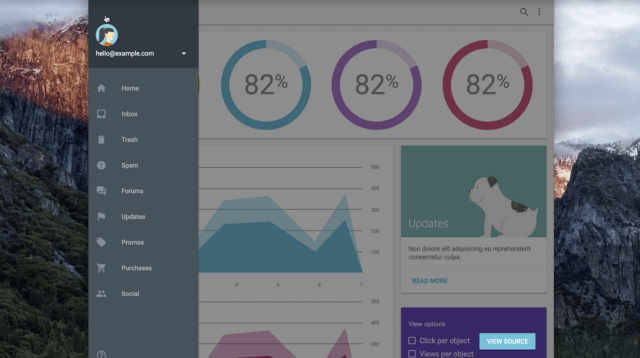
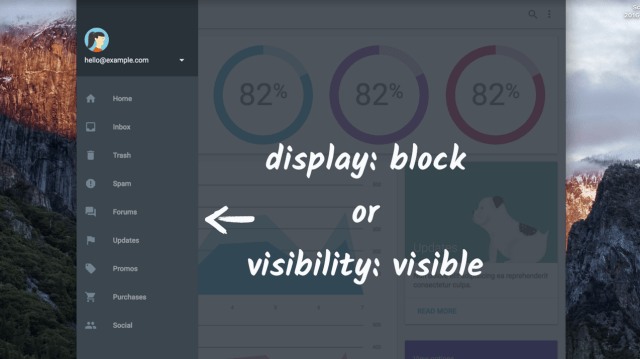

# DOM Order Matters

[サンプル](./dom-order-matter.html) 上で `Tab` を押すと**OK 例**ではマークアップ順にボタンがフォーカスされる。

DOM での順序を保持したまま表示順を異なるようにしてしまうと（**NG 例**)、フォーカスされる順番が直感的ではなくなる。

WebAIM チェックリストのセクション 1.3.2 では、[コード順によって決定される読み取りとナビゲーションの順序は、論理的かつ直感的にする必要がある](https://webaim.org/standards/wcag/checklist#sc1.3.2)と既定されている。

**習慣的にタブオーダーがおかしなことになっていないかを確認する**

## 画面外のコンテンツ

現在表示されていなくても DOM には必要なコンテンツ（レスポンシブサイドナビゲーションなど）にはフォーカスがあたらないようにし、ユーザーが操作できる範囲でのみフォーカスが当たるようにする。

### 対応

コンソールで `document.activeElement` を使用することで現在フォーカスされている要素を取得できる。

現在フォーカスが当たっている画面外の要素を特定できたら、それを `display: none` または `visibility: hidden` に設定をすることでフォーカスが当たらなくなる。  
元に戻す場合は `display: block | inline` または `visibility: visible` を設定する。

公開前にデベロッパー側でサイト上をタブで移動し、フォーカスが消えたり、論理的ではない順序で移動したりしないことを確認する。

問題がある場合は、`display: none` または `visibility: hidden` で画面外のコンテンツを適切に非表示にするか、要素の DOM での物理的な位置を変更して論理的な順序になるようにする必要がある。
