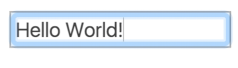

# Introduction to Focus

## Focus とは

フォーカスは、任意の時点におけるキーボード イベントの行き先を決定する。たとえば、テキスト入力フィールドにフォーカスを合わせて入力を開始すると、入力フィールドはキーボード イベントを受信し、入力された文字を表示する。フォーカスがある間は、クリップボードから貼り付けられた入力も受信する。

現在フォーカスされているアイテムは、多くの場合、**フォーカスリング**で示される。このスタイルは、ブラウザとページ作成者が適用したスタイル設定の両方に依存する。たとえば、Chrome では、通常、フォーカスされている要素が青色の枠でハイライト表示されるが、Firefox では破線が使用される。

WebAIM チェックリストのセクション 2.1.1 では、キーボードで処理できないもの（手書き図など）を除き、[すべてのページ機能をキーボードで使用できるようにする必要がある](https://webaim.org/standards/wcag/checklist#sc2.1.1)と明記している。

### Tab

ユーザーは `Tab` や `Shift + Tab` ,
または矢印キーを使用して現在フォーカスされている要素を制御できる（※ブラウザによって動作は異なる）

フォーカスが `Tab` でインタラクティブな要素を前後に移動する順序は**タブオーダー**と呼ばれる。論理的なタブオーダーでページを設計することは重要なステップとなる。

## フォーカス可能とは

暗黙的にフォーカスが可能な要素。これらの要素は自動的にタブオーダーに追加される。

* テキストフィールド
* ボタン
* 選択リスト

p、div、そのほかのさまざまなページ要素はタブで移動してもフォーカスされない設計になっている。ユーザーが操作できないものは、フォーカスする必要はない。

## フォーカスの使用

[サンプル](http://udacity.github.io/ud891/lesson2-focus/01-basic-form/)

* キーボードのみを使用してフォームを操作できると非常に便利
* いったんマウスに切り替えてからキーボードに戻ってタスクを完了する必要がない
* フォームで使用されているすべての要素は、暗黙的なフォーカスのあるネイティブ HTML タグであるため、フォームはキーボードで適切に動作し、フォーカス動作の追加や管理のためのコードを記述する必要がない。
