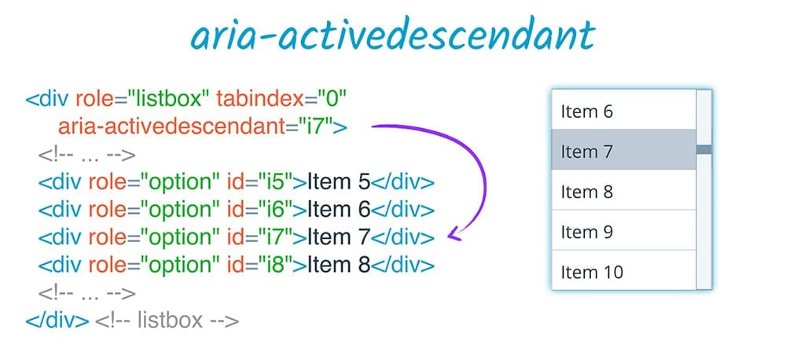
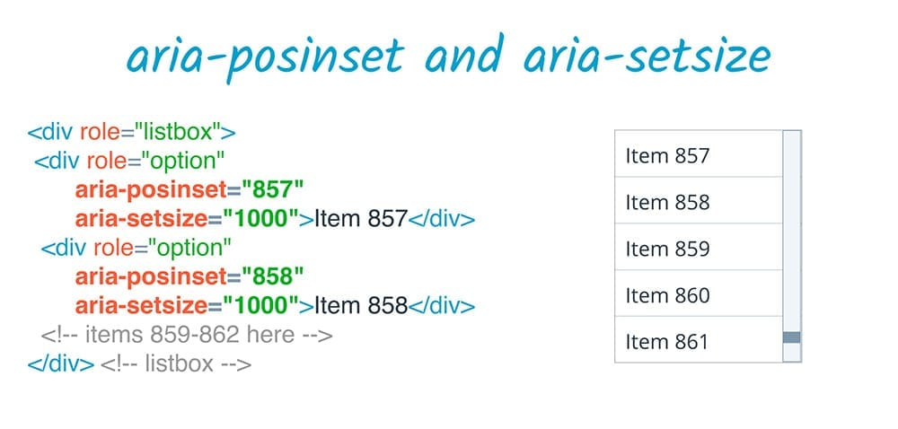

# ARIA ラベルと関係性

ARIA は要素にラベルと説明を加える複数の仕組みを提供する。実際に、ARIA はユーザー補助のサポートや説明テキストを追加できる唯一の方法。

## ラベル

### aria-label

テキストの代わりに画像だけで目的を示しているボタンがあるとする。この視覚的なマークを見ることができないユーザー向けに目的を明確に示したい場合、`aria-label` 属性を使用することがある。

`aria-label` でアクセス可能なラベルに使用する文字列を指定できる。これは label 要素など、その他のネイティブのラベル付けの仕組みよりも優先される。たとえば、button にテキスト コンテンツと `aria-label` の両方が存在する場合、`aria-label` の値のみが使用されれる。

### aria-labelledby

`aria-labelledby` によって、DOM 内の別の要素の ID を要素のラベルとして指定できる。

#### `label` 要素との違い

1.  `aria-labelledby` はどの要素でも使用でき、ラベル付けが可能な要素に限定されない。
2.  `label` 要素はラベルを付ける対象を参照しますが、`aria-labelledby` の場合はその関係が反対。つまり、ラベルを付けられる側からラベルを付ける側を参照する。
3.  `label` 要素は 1 つのラベル付け可能な要素とのみ関連付けることができるが、`aria-labelledby` では IDREF のリストを受け取り、複数の要素からラベルを作成することができる。 ラベルは IDREF で指定された順序で連結される。
4.  `aria-labelledby` を使用すると、非表示またはアクセシビリティツリーに存在しない要素も参照できます。たとえば、ラベルを付けたい要素の横に非表示の `span` を追加し、`aria-labelledby` でその要素を参照できます。
5.  ARIA はアクセシビリティツリーのみに影響するため、`aria-labelledby` には、`label` 要素を使用したときのおなじみのラベルクリック動作はありません。

重要な点として、要素のその他 **すべての**名前ソースよりも `aria-labelledby` が優先される。たとえば、`aria-labelledby` と `aria-label`、または `aria-labelledb`y とネイティブ HTML label の両方が要素に指定されていると、`aria-labelledby` ラベルが常に優先され  る。

## 関係性

関係性属性 - DOM の関係にかかわらず、ページ上の要素感でセマンティックな関係を構築する。

`aria-labelledby` は関係性属性の一例で、「この要素は、あの要素によってラベルが付けられる」という関係になります。

### aria-owns

DOM 内の独立した要素を現在の要素の子として扱うように、または既存の子要素を別の順序で並べ替えるように、支援技術に対して指定できる。

### aria-activedescendant

ページのアクティブ要素はフォーカスを持つ要素であるのと同様に、要素のアクティブな子孫を設定すると、実際には親にフォーカスが存在するときに、その子孫要素をフォーカスのある要素としてユーザーに提供するよう支援技術に指定できる。

### aria-describedby

`aria-describedby` は、`aria-labelledby` によるラベルの提供と同様に、アクセス可能な説明を提供する。`aria-labelledby` と同様に DOM が非表示であれ、支援技術のユーザーに対して非表示であれ参照することができる。

この典型的な例は、パスワードの最小要件に関する説明テキストを伴うパスワード入力フィールド。ラベルとは異なり、この説明は必ず表示されるとは限らない。

### aria-posinset と aria-setsize

`aria-posinset`（「セット内の配置」）と `aria-setsize`（セットのサイズ）は、リストなど、セットに含まれる子要素間の関係を定義する際に使用する。

