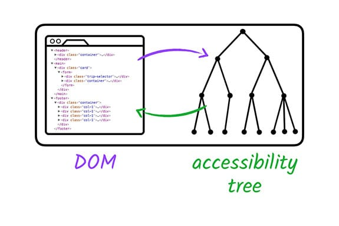
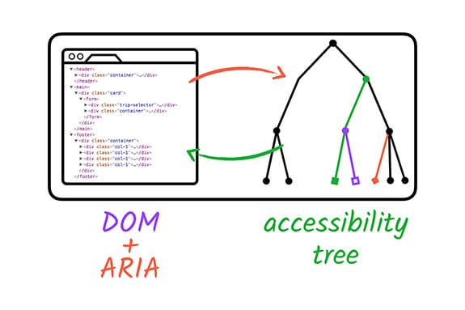
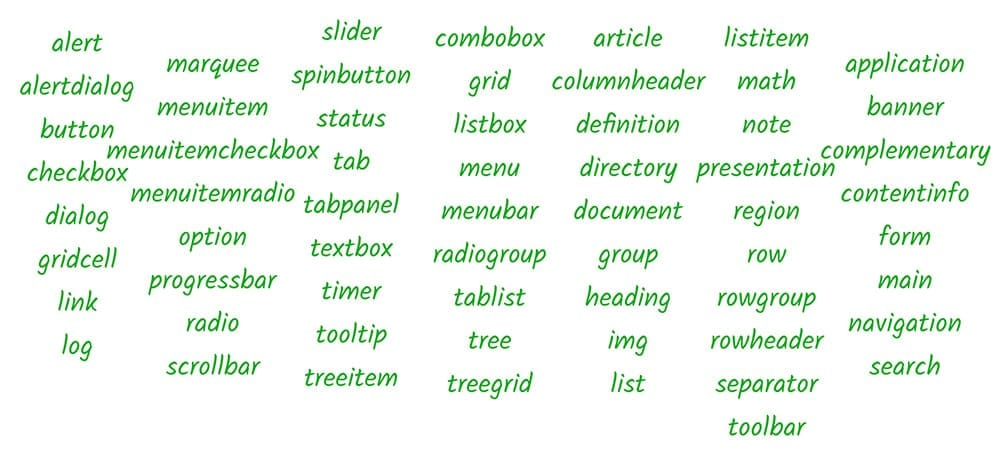

# ARIA の概要

 ネイティブ HTML で表現できないセマンティクスがある。
例えば「ユーザーはこの情報を速やかに知る必要がある」といったもの。

[Web Accessibility Initiative's Accessible Rich Internet Applications 仕様](https://www.w3.org/TR/wai-aria/) （WAI-ARIA、または単に ARIA）は、ネイティブ HTML で対応できないアクセシビリティの問題がある領域を仲介するのに適しており、アクセシビリティツリーを変更および拡張することで機能します。

カスタムチェックボックスの例

```html
<li tabindex="0" class="checkbox" checked>
  Receive promotional offers
</li>
```

`.checkbox` に対して視覚的にはチェックボックスのように見せたとしても、リーダーにはその情報は伝えられない。

```html
<li tabindex="0" class="checkbox" role="checkbox" checked aria-checked="true">
  Receive promotional offers
</li>
```

`role` 属性と `aria-checked` 属性を追加することで、要素をチェックが入ったチェックボックスとしてリーダーに伝えることができるようになる。

ARIA が変更するのはアクセシビリティツリーのみ。**ARIA は、要素の継承の動作を拡張しない。**
つまり、要素をフォーカス可能にしたり、キーボードイベントリスナにフォーカスを渡したりすることはない。




**重要**：デフォルトのセマンティクスを再定義する必要はない。`<input type="checkbox">` に `role="checkbox"` は不要。

## ARIA の機能

- 既存の要素のセマンティクスを変更する
- ネイティブのセマンティクスが存在しない要素にセマンティクスを追加する

- 支援技術 API だけに提供される追加のラベルや説明テキストを追加する

```html
<button aria-label="screen reader only label"></button>
```

- 標準の親 / 子接続を拡張する要素の間で、特定の領域を制御するカスタムスクロールバーなど、セマンティクスの関係を表現できます。

```html
<div role="scrollbar" aria-controls="main"></div>
<div id="main">
. . .
</div>
```

- ページの一部を "live" に指定し、その領域が変更されたら即座に支援技術に知らせる。

```html
<div aria-live="true">
  <span>GOOG: $400</span>
</div>
```

ARIA システムの主要な側面の 1 つは、role のコレクションである。ユーザー補助機能の観点で、role は特定の UI パターンを簡潔に表す指標になる。ARIA には、任意の HTML 要素で role 属性を使用して表現できるさまざまなパターンの定義がある。



前の例では、role="checkbox" を適用したとき、その要素が「checkbox」パターンに従う必要があることを支援技術に伝えている。つまり、チェックの状態（オンまたはオフ）が存在し、標準 HTML の checkbox 要素のように、その状態をマウスやスペースバーで切り替えられることを保証している。

ただし、この仕様は非常に細かいため、使用を開始するにあたっては [ARIA Authoring Practices ドキュメント](https://www.w3.org/TR/wai-aria-practices-1.1/)のほうが読みやすいでしょう。これは、使用可能な ARIA の役割とプロパティを使用する際のベスト プラクティスについて説明しています。

ARIA では、HTML5 で使用できるオプションを拡張するランドマークの役割も提供しています。詳細については、[ランドマークの役割のデザインパターン](https://www.w3.org/TR/wai-aria-practices-1.1/#kbd_layout_landmark_XHTML)で仕様をご覧ください。
