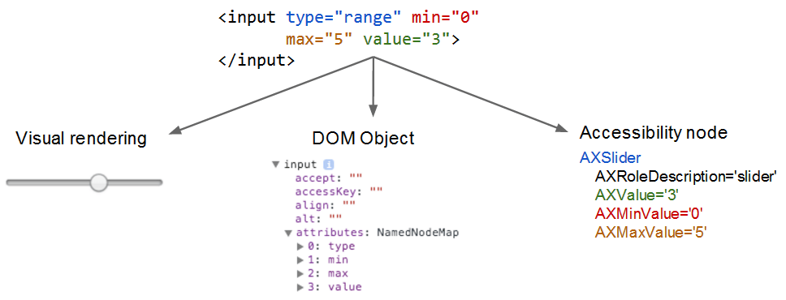

# セマンティクスの概要

## 支援技術

支援技術とは、障害のためにタスクを完了するのが困難な方達を支援するデバイス、ソフトウェア、ツールを包括的に表す用語。 **なんらかのタスクを行う人を支援するすべての技術**

広い意味では、歩行用の杖や読書用の虫メガネのようなローテクから、ロボット義手やスマートフォンの画像認識ソフトウェアなどのハイテクまで該当される。

* ブラウザのズーム
* カスタムデザインのゲームコントローラ
* 点字ディスプレイのような独立した物理デバイス
* 音声制御などソフトウェアに完全に組み込まれたもの
* スクリーンリーダーのように OS に組み込むもの
* Chrome 拡張機能のようなアドオン

また、技術は「支援」の枠を超える場合がある。

支援目的 → 汎用化

* 視覚障がい者向けの音声計算機 → ルート案内からバーチャルアシスタント

汎用目的 → 支援化

* カメラでズーム撮影 → 低視力の方がスマートフォンのカメラ機能でズームを使う

## アフォーダンス

アフォーダンスとは、ユーザーに **アクションを実行する機会を提供** または **説明するもの** を指す。

アフォーダンスが適切にデザインされていれば、よりわかりやすく、直感的に使用できる。つまり、ツールやデバイスを使用するとき、その形式やデザインを見ると、機能や使い方について理解することができる。

* 持つ場所は取っ手
  * 初めて見る画像だが経験則から認識できる

### GUI におけるアフォーダンス

GUI の世界では操作できる物体が存在しないため、アフォーダンスはあいまいになりがち。

そのため最小限のトレーニングで使い方が伝わるように、ボタン、チェックボックス、スクロールバーなどは曖昧さを排除して設計されている。

* ラジオボタン: 「これらのオプションのうち 1 つを選択できます」
* チェックボックス: 「このオプションで "はい" または "いいえ" を選択できます」
* テキスト フィールド: 「この領域になにかを入力できます」
* プルダウン: 「この要素を開いて、オプションを表示できます」

しかし、これらの要素は視覚に障がいを持つユーザーに伝えることはできない。
→ ユーザーのニーズに合った代替インターフェースを構築できる支援技術で柔軟に情報へアクセスできるようにする必要がある。

このように非視覚的なアフォーダンスの提供方法を **セマンティクス** とよぶ。

## スクリーンリーダー

生成された音声で画面上のテキストを読み上げることで、視覚障がいを持つ方がコンピューターを使用できるようにするプログラム。

(ChromeVox Lite デモページ)[http://udacity.github.io/ud891/lesson3-semantics-built-in/02-chromevox-lite/]

ChromeVox Lite は JS で記述された最小限の機能を持つスクリーンリーダー。

### スクリーンリーダーに期待される機能

適切に設計されたリーダーは指定された要素に関する次のような情報を全て、あるいは少なくともその大半をユーザーに伝えることが期待される。

* 要素の役割またはタイプ。指定されている場合（必要）
* 要素の名前。存在する場合（必要）
* 要素の値。存在する場合（任意）
* 要素の状態。有効 / 無効など（該当する場合）

ネイティブ要素にはユーザー補助機能のメタデータが組み込まれているため、スクリーンリーダーはこの代替 UI を作成することができる。レンダリングエンジンがネイティブコードを使用して視覚的なインターフェースを作成するのと同様に、スクリーンリーダーは DOM ノードのメタデータを使用して、次のようにアクセス可能なバージョンを作成することができる。

