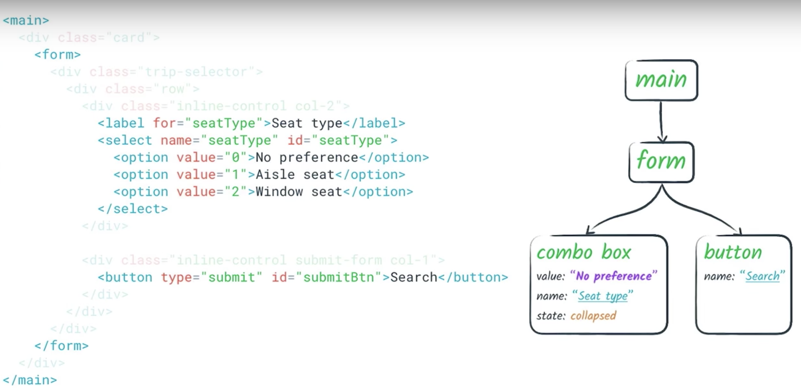

# アクセシビリティツリー

ブラウザは DOM ツリーを変更して支援技術（ここではスクリーンリーダーを想定）が必要とする情報だけを提供する。


ビジュアルスタイルの情報は入っておらずノード数も少ない。

アクセシビリティツリーとは DOM ツリーのサブセットにあたり、マークアップされた構造を保ちつつ各要素のアフォーダンスについての情報を提供する。



アクセシビリティツリーはほとんどの支援技術で利用されており、下記のようなフローが行われている。

1.  アプリケーション（ブラウザなどのアプリ）が API を介して、セマンティックな UI を支援技術に提供。
2.  支援技術は API を介して読み取った情報を使用し、代替ユーザーインターフェースの表現を作成。たとえば、スクリーンリーダーは、ユーザーがアプリの音声表現を聞き取れるインターフェースを作成する。
3.  支援技術は違う方法で、ユーザーがアプリを操作できるようにする場合がある。たとえば、ほとんどのスクリーンリーダーは、ユーザーが容易にマウスクリックや指によるタップをシミュレートできるように、フックを提供している。
4.  支援技術は、アクセシビリティ API を介してユーザーの行動（「クリック」など）をアプリに伝える。アプリは、元の UI のコンテキストでそのアクションを適切に解釈する必要がある。

### ブラウザが担う処理

1.  Web アプリ・ページ（DOM）をアクセシビリティツリーに変換。
2.  支援技術から受け取ったユーザーのアクションに基づいて、JS で適切なイベントが発行されるようにする。

### 開発者の役割

上のフローを理解し、ユーザーがアクセスできる環境を整える。

* ページのセマンティクスを正しく表現すること
  * ページ内の重要な要素に適切な役割、状態、プロパティをつける
  * アクセス可能な名前と説明を指定する

## ネイティブ HTML のセマンティクス

ほとんどのネイティブ HTML 要素はセマンティックな情報を持っているため、ブラウザは DOM ツリーをアクセシビリティツリーに変換することができる。

### 見た目がネイティブ要素

例えば div で見た目はボタンにしていても、スクリーンリーダーはそれがボタン要素だと認識できない（役割、状態、プロパティを取得できない）。またこのようなカスタムコンポーネントを作る場合はネイティブのキーインタラクション、button であれば tabindex の付与などが必要になる（キーボードのみで操作できるようにするため）

これを解決するにはどうしたらよいか。 → **ネイティブ（上の例だったら button）要素を素直に使う**

### 要素の名前を取得する

適切なネイティブの要素からリーダーは役割、状態、値を取得できるが、名前も検出する必要がある。名前には以下の２つのタイプがある。

* [表示可能なラベル](https://www.w3.org/TR/accname-1.1/) ex. `<a href="#">表示可能なラベル</a>`
* 代替テキスト（視覚的なラベルが不要なときにのみ使用される）

c.f. テキスト以外のコンテンツには代替テキストを指定する必要がある。
[WebAIM 1.1.1 Non-text Content](https://webaim.org/standards/wcag/checklist#g1.1)

代替テキストを指定する方法の１つは「フォームの入力要素に、関連するテキストのラベルを付ける」こと。

#### フォーム要素とラベルの関連付け

```html
<label>
  <input type="checkbox">プロモーション情報を受け取る
</label>
```

または

```html
<label for="promo">プロモーション情報を受け取る</label>
<input id="promo" type="checkbox">
```

ポイント: 実際にスクリーンリーダーを使用して、ページ内をタブで移動しながら、読み上げられる役割、状態、名前を確認すると、不適切に関連付けられたラベルを見つけることができる。
